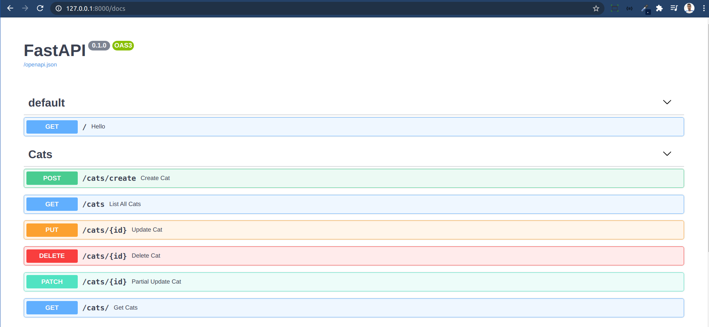
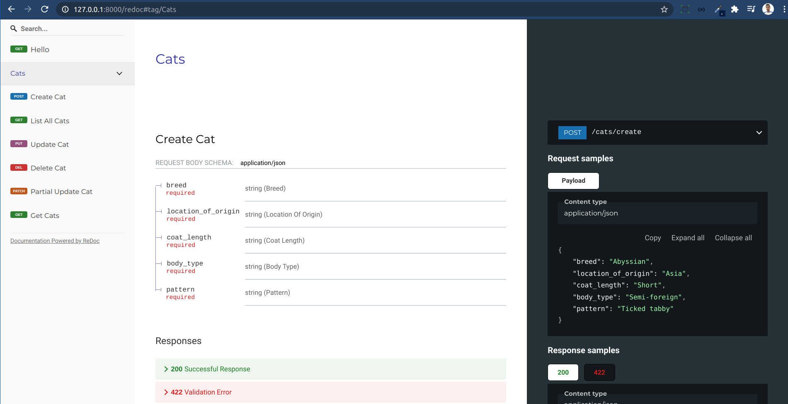

 

# 🎯 CatAPI - Simple project using python FastAPI

## 📋 Sumary

- [📋 Sumary](#-sumary)

- [📖 About](#-about)

- [🛠 Technologies used](#-technologies-used)

- [⚙ How to run the project](#-how-to-run-the-project)

- [⚖ License](#-license)


## 📖 About

This project consists of a simple API developed using python FastAPI. The intention was to take the first steps with this new technology that I am studying and exploring its simplicity.

## 🛠 Technologies used

For the development of this simple project, the following technologies were used:

- [FastAPI 0.63.0](https://fastapi.tiangolo.com/)
- python 3.8.0
- PostgreSQL
- Python Requests

## ⚙ How to run the project

To reproduce this project follow the steps below:

- Clone this repository:

  ```sh
  git clone https://github.com/lucasousa/catApi.git
  ```

- Enter the catAPI folder:

  ```sh
  cd catAPI
  ```

- Create the virtual environment:

  ``` sh
   python3.8 -m venv env #I do it that way
  ```

- Create your Postgres database and then create an .env file at the root of the project. In this .env file add your login credentials with the database. The required information is as follows:

  ``` sh
   CONNECTION = postgresql
   HOST = 
   PORT = 
   USERNAME = 
   NAME = 
   PASSWORD = 
  ```

- Install the requirements:

  ```sh
    pip install -r requirements.txt
  ```

- Now just start the development server:

  ```sh
    uvicorn main:app --reload
  ```

- To see your application running, access:

  ```sh
    http://127.0.0.1:8000/
  ```

- To view the documentation generated by FastAPI and test the API endpoints, visit:

  ```sh
    http://127.0.0.1:8000/docs
  ```
  


- Or visit:
  ```sh
    http://127.0.0.1:8000/redoc
  ```
  


## ⚖ License

This repository is under license from [MIT](./LICENSE).
